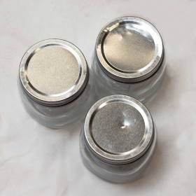
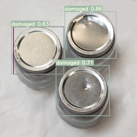

# 🛠️ Product Defect Detection Using YOLOv7

This project uses **YOLOv7** to detect defects in product packaging, such as scratches, deformations, and holes on jar lids.

## 📌 Features
- Trained YOLOv7 model to classify **intact** and **damaged** lids.
- Uses a **custom dataset** with labeled defects.
- Runs efficiently on **Google Colab** or a **local machine with GPU**.

## 🚀 Setup & Installation
1. **Clone YOLOv7 repository:**
   ```bash
   !git clone https://github.com/WongKinYiu/yolov7.git
   ```
2. **Install dependencies:**
   ```bash
   !pip install -r yolov7/requirements.txt
   ```
3. **Download pre-trained weights:**
   ```bash
   !wget https://github.com/WongKinYiu/yolov7/releases/download/v0.1/yolov7.pt -P yolov7/
   ```

## 📝 Training the Model
Run the following command to train the model:
```bash
!python yolov7/train.py --img 640 --batch 16 --epochs 100 \
  --data train.yaml --cfg yolov7_ad.yaml --weights yolov7/yolov7.pt \
  --hyp hypownsettings.yaml --device 0
```

## 📷 Running Inference on New Images
```bash
!python yolov7/detect.py --weights yolov7/runs/train/exp/weights/best.pt \
  --source new.jpg --img-size 640 --conf-thres 0.5
```
### 🖼️ Demonstration
#### Input Image:

#### Output Detection:


## 🔍 Evaluation
- **mAP@0.5**: Measures detection accuracy.
- **Precision & Recall**: Indicates model performance on defect detection.

## 🎯 Conclusion
This project demonstrates how YOLOv7 can be used for **automated defect detection** in product packaging, reducing manual inspection efforts and improving quality control.

## 🤝 Contributing
Feel free to fork this repository, make improvements, and submit a pull request.

## 📬 Contact
For any questions, reach out to **your.email@example.com**.

Happy Coding! 🚀
